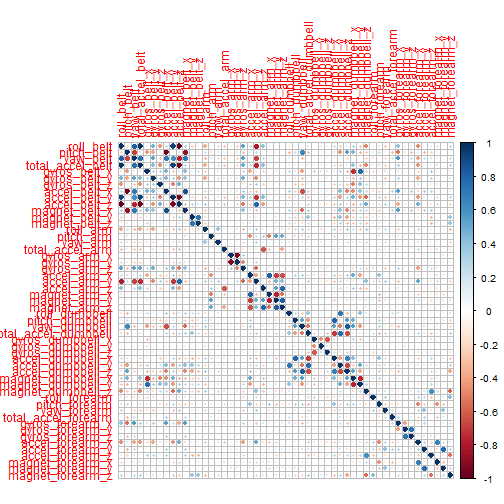

Practical Machine Learning (project)
========================================================
This project explores data on personal activities measurements, and based on those measurements it tries to predict the activity. (certain outputs are commented out for compactness)

Data is avaiable at:
* https://d396qusza40orc.cloudfront.net/predmachlearn/pml-training.csv
* https://d396qusza40orc.cloudfront.net/predmachlearn/pml-testing.csv

## Loading and Quick exploratory analysis ##

First we load required packages: caret, randomForest(model of choice) and corrplot(fast exploratory analysis)

```r
require(caret)
```

```
## Loading required package: caret
## Loading required package: lattice
## Loading required package: ggplot2
```

```r
require(corrplot)
```

```
## Loading required package: corrplot
```

```r
require(randomForest)
```

```
## Loading required package: randomForest
## randomForest 4.6-7
## Type rfNews() to see new features/changes/bug fixes.
```


Set seed for reproducibility of random forests and subsampling, and load datasets (here i assume that reader has the datasets on the harddrive already)

```r
set.seed(42)
training_data <- read.csv("pml-training.csv", na.strings = c("NA", ""))
testing_data <- read.csv("pml-testing.csv", na.strings = c("NA", ""))
# str(training_data)
```


First quick checking for complete cases shows us that a lot of data is missing, under half a thousand rows are complete. To check how widespread the problem is i count NAs by column

```r
sum(complete.cases(training_data))
```

```
## [1] 406
```

```r
missing_data = colSums(is.na(training_data))
# missing_data
```

and leave only correct columns (where NA is 0), actually most of them are either missing almost entirely (19000+ missing) or were all there (0 missing). By eliminating those columns we get almost clean training and test datasets

```r
training = training_data[, missing_data == 0]
testing = testing_data[, missing_data == 0]
sum(complete.cases(training))
```

```
## [1] 19622
```

I also chose to drop all timestamps, names, and other variables which didn't seem anyhow important at the front of the dataset (mainly descriptives about person/device/time), after which the correlation across remaining variables was run. 


```r
# str(training)
training = training[, 8:60]
testing = testing[, 8:60]
dim(training)
```

```
## [1] 19622    53
```

We can see that there are a few distinct patterns appear, suggesting that we can use principal components or factor analysis to reduce the dataset if we want. I chose to use random forest model, since it tends to give high accuracy, and typically requires a lot lower domain expertise for the problem, which would otherwise allow us to make reasonable assumptions about the model. To make the model faster i leave only ~15% of rows to make it faster (with full dataset it takes way too long, and the model doesn't become any better).


```r
index_vals = as.logical(rbinom(19622, 1, 0.15))
training_not_used = training[!index_vals, ]
training = training[index_vals, ]
corrplot(cor(training[, 1:52]))
```

 


## Model and Results ##

Fitting a random forest model with 5-fold CV (5 fold is chosen over more common 10-fold to speed the process up, since random forest is quite far away from being a model that fits fast):

```r
model = train(classe ~ ., data = training, method = "rf", trControl = trainControl(method = "cv", 
    index = createFolds(training$classe)))
```

```
## Loading required package: class
```


Now since we cut of ~85% of our training data and didn't do anything with it, we can actually use it to measure the expected accuracy (i.e use it as a first test set). The accuracy received is pretty high, given that we used only 15% of data

```r
predict_class_2 = predict(model, training_not_used)
sum(predict_class_2 == training_not_used$classe)/length(predict_class_2)
```

```
## [1] 0.962
```


Running actual testing dataset for the "autograde assignment part"

```r
predict_class = predict(model, testing)
pml_write_files = function(x) {
    n = length(x)
    for (i in 1:n) {
        filename = paste0("problem_id_", i, ".txt")
        write.table(x[i], file = filename, quote = FALSE, row.names = FALSE, 
            col.names = FALSE)
    }
}

# pml_write_files(predict_class)
```

Once the model is build predict the classe required for the submission (predicted correctly: 20/20)

## Conclusion ##
Overall decision trees based models tend to do a good job in predicting the outcome in complicated scenarios. As i mentioned earlier a domain expert might be able to simplify the model, since it is likely we are using a lot of unnecessary data, and model that is more complicated than needed.
